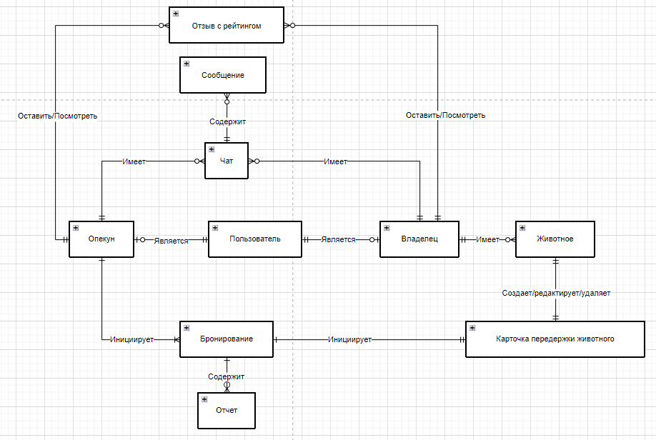
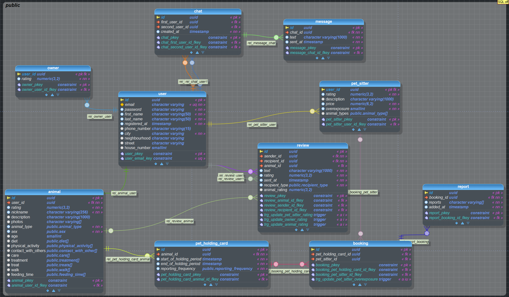

# Концептуальная схема

> Концептуальная схема нужна чтобы описывать основные объекты и их связи внутри системы

## Определение атрибутов к сущностям

### Пользователь

|Атрибут|Тип данных|Описание|Обязательное|Значение по умолчанию|Ограничения|
|-|-|-|-|-|-|
|Почта|Текстовый|Электронная почта пользователя|Да|||
|Пароль|Текстовый|Хэш пароля пользователя|Да|||
|Имя|Текстовый|Имя пользователя|Да||Длина до 50 символов|
|Фамилия|Текстовый|Фамилия пользователя|Да||Длина до 50 символов|
|Дата регистрации|Дата с временем|Дата и время регистрации пользователя|Да|Время на момент добавления ||
|Номер телефона|Текстовый|Номер телефона пользователя|Нет|||
|Город|Текстовый|Город проживания|Да|||
|Район|Текстовый |Район проживания|Нет|||
|Улица|Текстовый|Улица проживания|Нет|||
|Дом|Текстовый|Дом проживания|Нет|||

### Владелец

|Атрибут|Тип данных|Описание|Обязательное|Значение по умолчанию|Ограничения|
|-|-|-|-|-|-|
|Рейтинг|Числовой|Рейтинг владельца|Да|Вычисляется как среднее среди всех оценок владельца|От 0 до 5 с 2 знаками после запятой|

### Опекун

|Атрибут|Тип данных|Описание|Обязательное|Значение по умолчанию|Ограничения|
|-|-|-|-|-|-|
|Рейтинг|Числовой|Рейтинг опекуна|Да|Вычисляется как среднее среди всех оценок владельца|От 0 до 5 с 2 знаками после запятой|
|Описание|Текстовый|Описание опекуна|Нет||До 1000 символов|
|Цена за день|Числовой|Цена за 1 день передержки в рублях с 2 знаками после запятой|Да||От 1 до 99999|
|Совершенных передержек|Числовой|Количество выполненных передержек|Да|Вычисляется как количество всех передержек этого опекуна|Больше или равно 0|
|Тип животного|Текстовый|Из списка предложенных животных выбирается с какими типами работает опекун|Нет|||

### Животное

|Атрибут|Тип данных|Описание|Обязательное|Значение по умолчанию|Ограничения|
|-|-|-|-|-|-|
|Рейтинг|Числовой|Рейтинг животного|Да|Вычисляется как среднее среди всех оценок опекунов в бронированиях|От 0 до 5 с 2 знаками после запятой|
|Кличка|Текстовый|Кличка животного|Да||До 256 символов|
|Описание|Текстовый|Описание животного|Нет||До 1000 символов|
|Фотографии|Текстовый список|Список из ссылок на фотографии животного|Нет||Ссылки формата URI|
|Тип|Текстовый|Тип животного|Да||собака, кошка, кролик, птица, ежик, грызуны, рыбы, рептилии, фреткии, другие |
|Пол|Текстовый|Пол животного|Да||М или Ж|
|Возраст|Числовой|Возраст животного|Да||От 0 до 99|
|Диета|Текстовый список|Предпочтения в еде|Нет||один или множественный выбор происходит из списка ("Сухой корм", "Мокрый корм", "Домашняя еда", "Специальная диета", "Никаких лакомств")|
|Физическая активность|Текстовый список|Предпочтение в активности|Нет||один или множественный выбор происходит из списка ("Ежедневные прогулки", "Активные игры", "Пробежки", "Минимальная активность", "Игры на свежем воздухе", "Без прогулок")|
|Контакт с посторонними|Текстовый список|Предпочтения в общении|Нет||один или множественный выбор происходит из списка ("Высокий уровень общения", "Минимальный контакт с людьми", "Отсутствие других животных", "Контакт с детьми")|
|Уход|Текстовый список|Требования к уходу|Нет||один или множественный выбор происходит из списка ("Регулярное вычесывание", "Купание", "Стрижка когтей", "Чистка ушей", "Уход за шерстью", "Чистка зубов", "Чистка глаз")|
|Лечение|Текстовый список|Необходимое лечение|Нет||один или множественный выбор происходит из списка ("Ежедневный прием лекарств", "Инъекции", "Витамины", "Антиаллергены")|
|Лакомство|Текстовый список|Предпочтения по лакомствам|Нет||один или множественный выбор происходит из списка ("Овощи и фрукты", "Специальные лакомства для собак/кошек", "Лакомства запрещены", "Домашние лакомства")|
|Прогулки|Текстовый список|Предпочтения по прогулкам|Нет||один или множественный выбор происходит из списка ("Игры с мячом", "Погоня за игрушками", "Прятки", "Минимум активности", "Контактные игры")|
|Время кормления|Текстовый список|Время, когда надо кормить|Нет||один или множественный выбор происходит из списка ("Утро", "День", "Вечер", "Ночные кормления", "Свободный доступ к еде")|

### Карточка передержки животного

|Атрибут|Тип данных|Описание|Обязательное|Значение по умолчанию|Ограничения|
|-|-|-|-|-|-|
|Начало периода передержки|Дата и время|Дата и время, с которой нужна передержка|Да|||
|Конец периода передержки|Дата и время|Дата и время, по которую нужна передержка|Да|||
|Частота отчетности|Текстовый|Насколько часто нужна отчетность по животному его владельцу|Да||один выбор происходит из списка ("Каждый день, раз в 2 дня, раз в 3 дня, каждую неделю, в последний день передержки, не нужна")|

### Бронирование

|Атрибут|Тип данных|Описание|Обязательное|Значение по умолчанию|Ограничения|
|-|-|-|-|-|-|
|Опекун|Карточка опекуна|Карточка опекуна|Да||Карточка опекуна должен существовать|
|Карточка передержки животного|Карточка передержки животного|Карточка передержки животного|Да||Карточка передержки животного должна существовать|

### Отчет

|Атрибут|Тип данных|Описание|Обязательное|Значение по умолчанию|Ограничения|
|-|-|-|-|-|-|
|Отчеты|Текстовый список|Список из ссылок на медиафайлы (фотограции, видео) животного|Да||Ссылки формата URI|
|Время|Дата и время|Время отправки отчета|Да|Время на момент добавления ||

### Чат

|Атрибут|Тип данных|Описание|Обязательное|Значение по умолчанию|Ограничения|
|-|-|-|-|-|-|
|Время создания|Дата и время|Время создания чата|Да|Время на момент создания ||

### Сообщение

|Атрибут|Тип данных|Описание|Обязательное|Значение по умолчанию|Ограничения|
|-|-|-|-|-|-|
|Сообщение|Текстовый| Текст сообщения|Да||До 1000 символов|
|Время написания|Дата и время|Время отправки сообщения|Да|Время на момент отправки||

### Отзыв с рейтингом

|Атрибут|Тип данных|Описание|Обязательное|Значение по умолчанию|Ограничения|
|-|-|-|-|-|-|
|Автор|Пользователь|Пользователь, который поставил оценку|Да||Пользователь должен существовать|
|Получатель|Пользователь|Кому ставят оценку|Да||Пользователь должен существовать и не должен соответствовать отправителю|
|Сообщение|Текстовый|Текст отзыва|Нет|||
|Рейтинг|Числовой|Поставленная оценка|Да||От 0 до 5 с 2 знаками после запятой|
|Время|Дата и время|Время написания отзыва|Да|Время на момент добавления ||
|Тип получателя|Текстовый|Кто оставил отзыв|Да||Опекун или Владелец|

# Логическая схема

Логическая схема базы данных необходима для структурирования и визуализации взаимосвязей между сущностями в базе данных, что помогает в проектировании, оптимизации запросов и обеспечении целостности данных, а также облегчает понимание и поддержку системы для разработчиков и других участников проекта.

import Drawio from '@theme/Drawio'
import diagram from '!!raw-loader!./model.drawio';

<Drawio content={diagram} editable={false} />

# Физическая схема

Физическая схема базы данных описывает способы хранения данных, их распределение и индексацию

