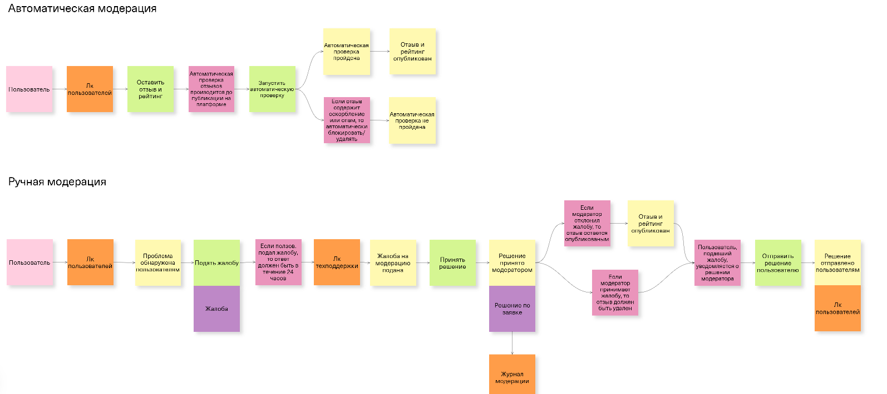
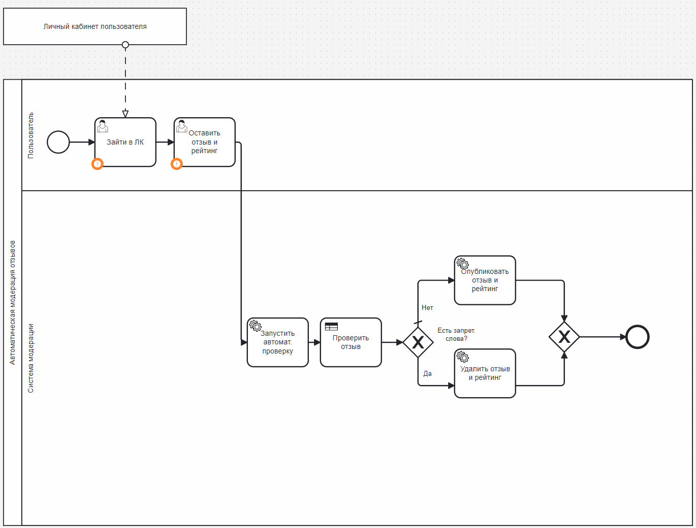
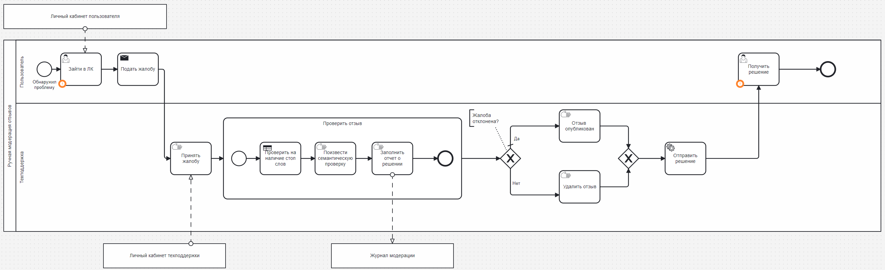

Для выполнения домашнего задания необходимо было спроектировать процессы в нотации BPMN, создать DMN-диаграмму

## Event Storming

[https://unidraw.io/app/board/7573c8e6274f116b9d4e](https://unidraw.io/app/board/7573c8e6274f116b9d4e)

В Event Storming представлена 2 вида проверок отзывов: автоматическая и ручная



## Автоматическая проверка

1. **Запуск проверки**: Проверка запускается перед каждой публикацией отзыва на платформе

2. **Проверка на запретные слова**:

    - Система проверяет отзыв на наличие запрещенных слов

    - Перечень запрещенных слов указан в DMN diagram

1. **Результат проверки**:

    - Если система обнаружила запрещенное слово, отзыв и рейтинг данного пользователя не публикуется

    - Если отзыв прошел проверку, отзыв и рейтинг публикуется в приложении

1. **Публикация**: В случае успешной проверки отзыв и рейтинг становятся доступными другим пользователям на платформе



ссылка на бизнес-процесс в camunda: [https://modeler.camunda.io/diagrams/deea720a-ed49-4a0f-9ab4-7c746b368dbc--автоматическая-модерация?v=716,354,1](https://modeler.camunda.io/diagrams/deea720a-ed49-4a0f-9ab4-7c746b368dbc--автоматическая-модерация?v=716,354,1)

## Ручная проверка

1. **Инициирование процесса**:

    - Пользователь отправляет жалобу на отзыв через личный кабинет

    - Техподдержка принимает данную жалобу для дальнейшей обработки

1. **Процесс проверки**:

    - **Проверка на наличие стоп-слов**: Отзыв проверяется на наличие запрещенных слов, указанных в DMN diagram

    - **Семантическая проверка**: Отзыв также проверяется на смысловую корректность (семантическая проверка)

1. **Принятие решения**:

    Модератор принимает решение о том, будет ли отзыв опубликован или удален:

        - Если отзыв корректен, он публикуется

        - Если отзыв нарушает правила, он удаляется

1. **Уведомление пользователя**:

    - Пользователь получает **уведомление** о принятом решении (публикация или удаление отзыва)



ссылка на бизнес-процесс в camunda: [https://modeler.camunda.io/share/0d014891-7699-4f32-8caa-452bd9c2757c](https://modeler.camunda.io/share/0d014891-7699-4f32-8caa-452bd9c2757c)

## DMN: Таблица запрещенных слов

Для автоматической модерации используется DMN. В таблице представлены примеры запрещенных слов и их категории, которые включают нецензурную лексику, оскорбления, рекламу, угрозы и другие запрещенные темы.

### Зачем использовала DMN?

Использование DMN обусловлено необходимостью автоматизировать рутинный процесс модерации отзывов. DMN-диаграмма  упрощает данный процесс, предоставляя механизм для уже известных правил модерации. В таблице DMN указаны конкретные слова в одном столбце и соответствующие им категории в соседнем. Это позволяет системе автоматически определять, к какой категории относится слово, встреченное в отзыве. В случае обнаружения слова из списка система идентифицирует его категорию и автоматически принимает решение об удалении отзыва.

Такой подход позволяет избежать необходимости прописывать каждое запрещённое слово в процессе. Вместо этого проверка производится на уровне категорий, что делает бизнес-процесс более понятным и менее перегруженным. Это упрощает логику проверки и снижает количество фильтраций, одновременно повышая гибкость и управляемость системы модерации.

ссылка на Decision Model and Notation 

## DMN  в формате XML

Для автоматической модерации используется DMN. В таблице представлены примеры запрещенных слов и их категории, которые включают нецензурную лексику, оскорбления, рекламу, угрозы и другие запрещенные темы.

### Зачем использовала DMN?

Использование DMN обусловлено необходимостью автоматизировать рутинный процесс модерации отзывов. DMN-диаграмма  упрощает данный процесс, предоставляя механизм для уже известных правил модерации. В таблице DMN указаны конкретные слова в одном столбце и соответствующие им категории в соседнем. Это позволяет системе автоматически определять, к какой категории относится слово, встреченное в отзыве. В случае обнаружения слова из списка система идентифицирует его категорию и автоматически принимает решение об удалении отзыва.

Такой подход позволяет избежать необходимости прописывать каждое запрещённое слово в процессе. Вместо этого проверка производится на уровне категорий, что делает бизнес-процесс более понятным и менее перегруженным. Это упрощает логику проверки и снижает количество фильтраций, одновременно повышая гибкость и управляемость системы модерации.

ссылка на Decision Model and Notation 

## DMN  в формате XML

[Критерии модерации отзывов (5).dmn](Моделирование+процессов+в+BPMN+a2977028-9ff2-4fa7-9781-467c210219d1/Критерии+модерации+отзывов++5+.dmn)

```Plain Text
<?xml version="1.0" encoding="UTF-8"?>
<definitions xmlns="https://www.omg.org/spec/DMN/20191111/MODEL/" xmlns:dmndi="https://www.omg.org/spec/DMN/20191111/DMNDI/" xmlns:dc="http://www.omg.org/spec/DMN/20180521/DC/" xmlns:modeler="http://camunda.org/schema/modeler/1.0" xmlns:biodi="http://bpmn.io/schema/dmn/biodi/2.0" id="Check_Red_Words" name="DRD" namespace="http://camunda.org/schema/1.0/dmn" exporter="Camunda Web Modeler" exporterVersion="957e002" modeler:executionPlatform="Camunda Cloud" modeler:executionPlatformVersion="8.6.0">
  <decision id="Decision_0xeq9r2" name="Red Words">
    <decisionTable id="DecisionTable_0ijjlkd">
      <input id="Input_1">
        <inputExpression id="InputExpression_1" typeRef="string">
          <text>Слова</text>
        </inputExpression>
      </input>
      <output id="Output_1" name="Категория" typeRef="string" biodi:width="204" />
      <rule id="DecisionRule_1b3rn9y">
        <inputEntry id="UnaryTests_1em1hgi">
          <text>contains(word,"блять")</text>
        </inputEntry>
        <outputEntry id="LiteralExpression_0alp5x8">
          <text>Нецензурная брань</text>
        </outputEntry>
      </rule>
      <rule id="DecisionRule_05jbc3n">
        <inputEntry id="UnaryTests_1wb2s3o">
          <text>contains(word,"сука")</text>
        </inputEntry>
        <outputEntry id="LiteralExpression_12uea82">
          <text>Нецензурная брань</text>
        </outputEntry>
      </rule>
      <rule id="DecisionRule_0px31c7">
        <inputEntry id="UnaryTests_0t8hqux">
          <text>contains(word,"пидорас")</text>
        </inputEntry>
        <outputEntry id="LiteralExpression_0gwayfi">
          <text>Нецензурная брань</text>
        </outputEntry>
      </rule>
      <rule id="DecisionRule_032iamo">
        <inputEntry id="UnaryTests_02syurf">
          <text>contains(word,"шлюха")</text>
        </inputEntry>
        <outputEntry id="LiteralExpression_0gtgkx4">
          <text>Нецензурная брань</text>
        </outputEntry>
      </rule>
      <rule id="DecisionRule_1h95ttk">
        <inputEntry id="UnaryTests_1spcujr">
          <text>contains(word,"пизда")</text>
        </inputEntry>
        <outputEntry id="LiteralExpression_1m7fpf5">
          <text>Нецензурная брань</text>
        </outputEntry>
      </rule>
      <rule id="DecisionRule_02bp067">
        <inputEntry id="UnaryTests_0ia0uye">
          <text>contains(word,"ебать")</text>
        </inputEntry>
        <outputEntry id="LiteralExpression_03c3lut">
          <text>Нецензурная брань</text>
        </outputEntry>
      </rule>
      <rule id="DecisionRule_0o5ckpc">
        <inputEntry id="UnaryTests_0fw0u07">
          <text>contains(word,"нахуй")</text>
        </inputEntry>
        <outputEntry id="LiteralExpression_0xvutc4">
          <text>Нецензурная брань</text>
        </outputEntry>
      </rule>
      <rule id="DecisionRule_0a6m8zi">
        <inputEntry id="UnaryTests_0j3sjnt">
          <text>contains(word,"придурак")</text>
        </inputEntry>
        <outputEntry id="LiteralExpression_113afoy">
          <text>Оскорбления</text>
        </outputEntry>
      </rule>
      <rule id="DecisionRule_174slqt">
        <inputEntry id="UnaryTests_0jppj6y">
          <text>contains(word,"дурак")</text>
        </inputEntry>
        <outputEntry id="LiteralExpression_0xr3lpo">
          <text>Оскорбления</text>
        </outputEntry>
      </rule>
      <rule id="DecisionRule_0jo0c76">
        <inputEntry id="UnaryTests_1k0nr9x">
          <text>contains(word,"ебнутый")</text>
        </inputEntry>
        <outputEntry id="LiteralExpression_0d5i0ms">
          <text>Нецензурная брань</text>
        </outputEntry>
      </rule>
      <rule id="DecisionRule_1op805x">
        <inputEntry id="UnaryTests_1mozn53">
          <text>contains(word,"безмозглый")</text>
        </inputEntry>
        <outputEntry id="LiteralExpression_1x54t3z">
          <text>Оскорбления</text>
        </outputEntry>
      </rule>
      <rule id="DecisionRule_1t8jfnd">
        <inputEntry id="UnaryTests_1b72e8z">
          <text>contains(word,"мошенник")</text>
        </inputEntry>
        <outputEntry id="LiteralExpression_14vrmjp">
          <text>Оскорбления</text>
        </outputEntry>
      </rule>
      <rule id="DecisionRule_170ax6g">
        <inputEntry id="UnaryTests_0qicx0i">
          <text>contains(word,"урод")</text>
        </inputEntry>
        <outputEntry id="LiteralExpression_1qw903j">
          <text>Оскорбления</text>
        </outputEntry>
      </rule>
      <rule id="DecisionRule_15jmmo6">
        <inputEntry id="UnaryTests_0jrj43c">
          <text>contains(word,"тупица")</text>
        </inputEntry>
        <outputEntry id="LiteralExpression_12ucw3d">
          <text>Оскорбления</text>
        </outputEntry>
      </rule>
      <rule id="DecisionRule_00v2mj8">
        <inputEntry id="UnaryTests_0ejes45">
          <text>contains(word,"скидка")</text>
        </inputEntry>
        <outputEntry id="LiteralExpression_10q9tr7">
          <text>Реклама</text>
        </outputEntry>
      </rule>
      <rule id="DecisionRule_0gjdlqh">
        <inputEntry id="UnaryTests_0vhh155">
          <text>contains(word,"бесплатный")</text>
        </inputEntry>
        <outputEntry id="LiteralExpression_1gaskmz">
          <text>Реклама</text>
        </outputEntry>
      </rule>
      <rule id="DecisionRule_1yu5wh7">
        <inputEntry id="UnaryTests_0tuomc7">
          <text>contains(word,"акция")</text>
        </inputEntry>
        <outputEntry id="LiteralExpression_01zw7xf">
          <text>Реклама</text>
        </outputEntry>
      </rule>
      <rule id="DecisionRule_0akpri9">
        <inputEntry id="UnaryTests_0vbfq7c">
          <text>contains(word,"предложение")</text>
        </inputEntry>
        <outputEntry id="LiteralExpression_1txfe91">
          <text>Реклама</text>
        </outputEntry>
      </rule>
      <rule id="DecisionRule_0bmz7ue">
        <inputEntry id="UnaryTests_1ac6k9u">
          <text>contains(word,"купи")</text>
        </inputEntry>
        <outputEntry id="LiteralExpression_1eu6tnn">
          <text>Реклама</text>
        </outputEntry>
      </rule>
      <rule id="DecisionRule_1rwmjj3">
        <inputEntry id="UnaryTests_110d3ts">
          <text>contains(word,"закажи")</text>
        </inputEntry>
        <outputEntry id="LiteralExpression_0gf0dk4">
          <text>Реклама</text>
        </outputEntry>
      </rule>
      <rule id="DecisionRule_0t0bq0t">
        <inputEntry id="UnaryTests_1qh6t1i">
          <text>contains(word,"продается")</text>
        </inputEntry>
        <outputEntry id="LiteralExpression_15qi9qe">
          <text>Реклама</text>
        </outputEntry>
      </rule>
      <rule id="DecisionRule_16j7aiv">
        <inputEntry id="UnaryTests_1mq2j0i">
          <text>contains(word,"заработай")</text>
        </inputEntry>
        <outputEntry id="LiteralExpression_1vjiwn1">
          <text>Реклама</text>
        </outputEntry>
      </rule>
      <rule id="DecisionRule_1afp5xm">
        <inputEntry id="UnaryTests_08vylaj">
          <text>contains(word,"наркотики")</text>
        </inputEntry>
        <outputEntry id="LiteralExpression_0iamrtl">
          <text>Запрещенные темы</text>
        </outputEntry>
      </rule>
      <rule id="DecisionRule_14e4pza">
        <inputEntry id="UnaryTests_1m831k3">
          <text>contains(word,"оружие")</text>
        </inputEntry>
        <outputEntry id="LiteralExpression_12nhr92">
          <text>Запрещенные темы</text>
        </outputEntry>
      </rule>
      <rule id="DecisionRule_0ccj5tm">
        <inputEntry id="UnaryTests_1byursi">
          <text>contains(word,"порнография")</text>
        </inputEntry>
        <outputEntry id="LiteralExpression_1donax5">
          <text>Запрещенные темы</text>
        </outputEntry>
      </rule>
      <rule id="DecisionRule_1t9qo6j">
        <inputEntry id="UnaryTests_0f8w3pg">
          <text>contains(word,"насилие")</text>
        </inputEntry>
        <outputEntry id="LiteralExpression_0oprs7h">
          <text>Запрещенные темы</text>
        </outputEntry>
      </rule>
      <rule id="DecisionRule_06qep7m">
        <inputEntry id="UnaryTests_14ep4di">
          <text>contains(word,"вор")</text>
        </inputEntry>
        <outputEntry id="LiteralExpression_0vsow9c">
          <text>Оскорбления</text>
        </outputEntry>
      </rule>
      <rule id="DecisionRule_1gyhgmb">
        <inputEntry id="UnaryTests_0wjtyaq">
          <text>contains(word,"обманщик")</text>
        </inputEntry>
        <outputEntry id="LiteralExpression_11qmcif">
          <text>Оскорбления</text>
        </outputEntry>
      </rule>
      <rule id="DecisionRule_0dpo4s0">
        <inputEntry id="UnaryTests_0nap9an">
          <text>contains(word,"преступление")</text>
        </inputEntry>
        <outputEntry id="LiteralExpression_1pm6fhd">
          <text>Оскорбления</text>
        </outputEntry>
      </rule>
      <rule id="DecisionRule_00oul0e">
        <inputEntry id="UnaryTests_092anya">
          <text>contains(word,"ненавижу")</text>
        </inputEntry>
        <outputEntry id="LiteralExpression_1it786p">
          <text>Угрозы</text>
        </outputEntry>
      </rule>
      <rule id="DecisionRule_0jw5pik">
        <inputEntry id="UnaryTests_1eo6830">
          <text>contains(word,"убью")</text>
        </inputEntry>
        <outputEntry id="LiteralExpression_07bxesw">
          <text>Угрозы</text>
        </outputEntry>
      </rule>
      <rule id="DecisionRule_0libtsi">
        <inputEntry id="UnaryTests_1f7x2tw">
          <text>contains(word,"уничтожу")</text>
        </inputEntry>
        <outputEntry id="LiteralExpression_1akv4o0">
          <text>Угрозы</text>
        </outputEntry>
      </rule>
      <rule id="DecisionRule_0da42ef">
        <inputEntry id="UnaryTests_0jyxr0l">
          <text>contains(word,"порежу")</text>
        </inputEntry>
        <outputEntry id="LiteralExpression_0isisn7">
          <text>Угрозы</text>
        </outputEntry>
      </rule>
      <rule id="DecisionRule_1hj0xkv">
        <inputEntry id="UnaryTests_0ocqgvu">
          <text>contains(word,"порешаю")</text>
        </inputEntry>
        <outputEntry id="LiteralExpression_14f7458">
          <text>Угрозы</text>
        </outputEntry>
      </rule>
      <rule id="DecisionRule_1kdu4fi">
        <inputEntry id="UnaryTests_10eo9o4">
          <text>contains(word,"секс")</text>
        </inputEntry>
        <outputEntry id="LiteralExpression_1d4m1lo">
          <text>Запрещенные темы</text>
        </outputEntry>
      </rule>
      <rule id="DecisionRule_0gqj0xd">
        <inputEntry id="UnaryTests_046fzm6">
          <text>contains(word,"ЦП")</text>
        </inputEntry>
        <outputEntry id="LiteralExpression_11xaren">
          <text>Запрещенные темы</text>
        </outputEntry>
      </rule>
      <rule id="DecisionRule_04bfb1g">
        <inputEntry id="UnaryTests_15j4ymz">
          <text>contains(word,"CP")</text>
        </inputEntry>
        <outputEntry id="LiteralExpression_0q7yam0">
          <text>Запрещенные темы</text>
        </outputEntry>
      </rule>
      <rule id="DecisionRule_0csha5g">
        <inputEntry id="UnaryTests_1bzyu91">
          <text>contains(word,"ЛГБТ")</text>
        </inputEntry>
        <outputEntry id="LiteralExpression_1fpchhb">
          <text>Запрещенные темы</text>
        </outputEntry>
      </rule>
      <rule id="DecisionRule_1l2hlcj">
        <inputEntry id="UnaryTests_069c4t8">
          <text>contains(word,"лесби")</text>
        </inputEntry>
        <outputEntry id="LiteralExpression_0m9tjzk">
          <text>Запрещенные темы</text>
        </outputEntry>
      </rule>
      <rule id="DecisionRule_14z65n8">
        <inputEntry id="UnaryTests_0nib8cp">
          <text>contains(word,"геи")</text>
        </inputEntry>
        <outputEntry id="LiteralExpression_1f3i477">
          <text>Запрещенные темы</text>
        </outputEntry>
      </rule>
      <rule id="DecisionRule_0m11ljp">
        <inputEntry id="UnaryTests_1fdq6du">
          <text>contains(word,"трансы")</text>
        </inputEntry>
        <outputEntry id="LiteralExpression_0iw1rkq">
          <text>Запрещенные темы</text>
        </outputEntry>
      </rule>
      <rule id="DecisionRule_1mc8uyv">
        <inputEntry id="UnaryTests_1mf9tyi">
          <text>contains(word,"гандон")</text>
        </inputEntry>
        <outputEntry id="LiteralExpression_0chlx7z">
          <text>Нецензурная брань</text>
        </outputEntry>
      </rule>
    </decisionTable>
  </decision>
  <dmndi:DMNDI>
    <dmndi:DMNDiagram>
      <dmndi:DMNShape dmnElementRef="Decision_0xeq9r2">
        <dc:Bounds height="80" width="180" x="160" y="100" />
      </dmndi:DMNShape>
    </dmndi:DMNDiagram>
  </dmndi:DMNDI>
</definitions>
```