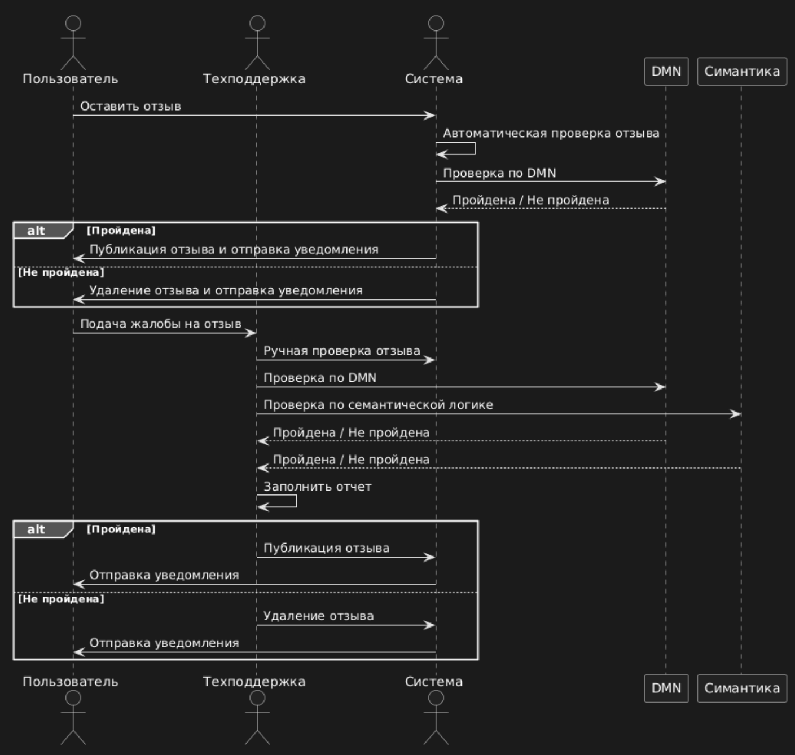
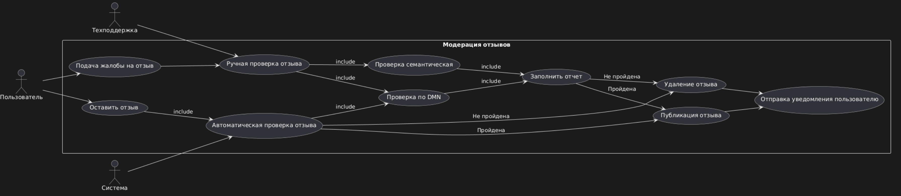

для выполнения задания необходимо создать диаграмму прецедентов (use case) и  диаграмму последовательностей (sequence) 

## Use case diagram (Диаграмма прецедентов)

- диаграмма, которая показывает, как пользователи (акторы) взаимодействуют с системой.

```Plain Text
@startuml
left to right direction
actor "Техподдержка" 
actor "Пользователь" 
actor "Система" 

rectangle "Модерация отзывов" {
    usecase "Оставить отзыв"
    usecase "Автоматическая проверка отзыва"
    usecase "Публикация отзыва"
    usecase "Удаление отзыва"
    usecase "Подача жалобы на отзыв"
    usecase "Ручная проверка отзыва"
    usecase "Проверка по DMN"
    usecase "Проверка семантическая"
    usecase "Отправка уведомления пользователю"
    usecase "Заполнить отчет"

}

"Пользователь" --> "Оставить отзыв"
"Пользователь" --> "Подача жалобы на отзыв"
"Оставить отзыв" --> "Автоматическая проверка отзыва" : include
"Система" --> "Автоматическая проверка отзыва"
"Автоматическая проверка отзыва" --> "Проверка по DMN": include
"Автоматическая проверка отзыва" --> "Публикация отзыва" : Пройдена
"Автоматическая проверка отзыва" --> "Удаление отзыва" : Не пройдена

"Техподдержка" --> "Ручная проверка отзыва"
"Ручная проверка отзыва" --> "Проверка по DMN" : include
"Ручная проверка отзыва" --> "Проверка семантическая" : include
"Проверка по DMN" --> "Заполнить отчет" : include
"Проверка семантическая" --> "Заполнить отчет" : include

"Заполнить отчет" --> "Публикация отзыва" : Пройдена
"Заполнить отчет" --> "Удаление отзыва" : Не пройдена

"Публикация отзыва" --> "Отправка уведомления пользователю"
"Удаление отзыва" --> "Отправка уведомления пользователю"
"Подача жалобы на отзыв" --> "Ручная проверка отзыва"

@enduml
```




## Sequence diagram (Диаграмма последовательности)

- диаграмма, которая показывает порядок взаимодействия между объектами или актерами в системе во времени

```Plain Text
@startuml
actor Пользователь
actor Техподдержка
actor Система

Пользователь -> Система : Оставить отзыв
Система -> Система : Автоматическая проверка отзыва
Система -> DMN : Проверка по DMN
DMN --> Система : Пройдена / Не пройдена

alt Пройдена
    Система -> Пользователь : Публикация отзыва и отправка уведомления
else Не пройдена
    Система -> Пользователь : Удаление отзыва и отправка уведомления
end

Пользователь -> Техподдержка : Подача жалобы на отзыв
Техподдержка -> Система : Ручная проверка отзыва
Техподдержка -> DMN : Проверка по DMN
Техподдержка -> Симантика : Проверка по семантической логике
DMN --> Техподдержка : Пройдена / Не пройдена
Симантика --> Техподдержка : Пройдена / Не пройдена

Техподдержка -> Техподдержка : Заполнить отчет

alt Пройдена
    Техподдержка -> Система : Публикация отзыва
    Система -> Пользователь : Отправка уведомления
else Не пройдена
    Техподдержка -> Система : Удаление отзыва
    Система -> Пользователь : Отправка уведомления
end
@enduml
```




