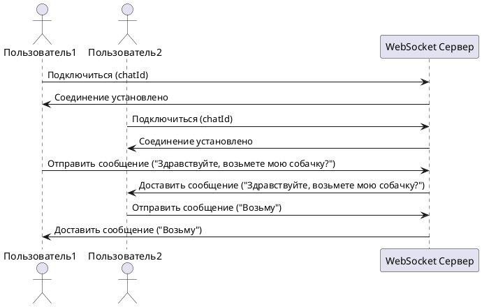

### Выбор технологии

В моей системе пользователи (как опекуны, так и владельцы) могут общаться в чате, который становится доступным после нажатия кнопки "Бронировать передержку/опекуна". В этом чате они обсуждают детали передержки, такие как цена, место и другие условия.

**Для реализации чата я выбрала технологию WebSocket**, так как она идеально подходит для таких задач. WebSocket позволяет установить постоянное соединение между клиентом и сервером, благодаря чему сообщения отправляются и принимаются в режиме реального времени без задержек. Это гораздо эффективнее по сравнению с HTTP, где для каждого сообщения приходится открывать и закрывать соединение заново. В WebSocket Соединение открывается только один раз и остаётся активным до завершения чата. В моем случае я буду передавать данные в формате JSON.

### Как работает?

1. Когда пользователь открывает чат, он подключается к WebSocket-серверу по адресу:
`wss://chat.purrandstay.com/chat/{chatId}` 

    2. `chatId` — это уникальный идентификатор конкретного чата.

3. После подключения пользователь может:

    - Отправлять сообщения на сервер

    - Получать новые сообщения от другого пользователя, с кем вы общаетесь, через сервер

### Формат передачи сообщения

```JSON
{
  "sessionId": "1234567890abcdef123",
  "message": "Вы заберете мою кошку на 2 дня?",
  "timestamp": "2024-11-18T14:25:00Z"
}
```

### Sequence diagram



## AsyncAPI

```yaml
asyncapi: '2.6.0'
info:
  title: API Личного Чата
  version: '1.0.0'
  description: |
    Это API предоставляет возможность отправки сообщений и медиафайлов между двумя пользователями в режиме реального времени через WebSocket.
    Каждый чат идентифицируется уникальным `chatId`. Пользователь аутентифицируется через `sessionId`

servers:
  chatServer:
    url: wss://chat.purrandstay.com
    protocol: wss
    description: Сервер WebSocket для работы с личным чатом

defaultContentType: application/json

channels:
  /chat/{chatId}:
    parameters:
      chatId:
        description: Уникальный идентификатор чата между двумя пользователями
        schema:
          type: string
          example: "abc123"
    description: Канал WebSocket для отправки и получения сообщений в чате
    subscribe:
      summary: Подписка на получение сообщений в указанном чате
      operationId: receiveMessage
      message:
        $ref: '#/components/messages/ChatMessage'
    publish:
      summary: Отправка сообщения в указанный чат
      operationId: sendMessage
      message:
        $ref: '#/components/messages/ChatMessage'

components:
  messages:
    ChatMessage:
      description: Личное сообщение, отправляемое или получаемое в чате
      payload:
        $ref: '#/components/schemas/ChatMessageSchema'

  schemas:
    ChatMessageSchema:
      type: object
      properties:
        sessionId:
          type: string
          description: Уникальный идентификатор сессии пользователя для аутентификации
          example: "session_1234567890abcdef"
        message:
          type: string
          description: Текст сообщения
          example: "Здравствуйте, возьмете мою собачку?"
        timestamp:
          type: string
          format: date-time
          description: Время отправки сообщения.
          example: "2024-11-18T12:34:56Z"

    ErrorSchema:
      description: Детали ошибки при выполнении операций
      type: object
      properties:
        code:
          type: integer
          description: Код ошибки, аналог HTTP-кода
          example: 400
        message:
          type: string
          description: Сообщение об ошибке.
          example: "Неверный формат сообщения"

tags:
  - name: Личный чат
    description: Операции, связанные с личным чатом
```