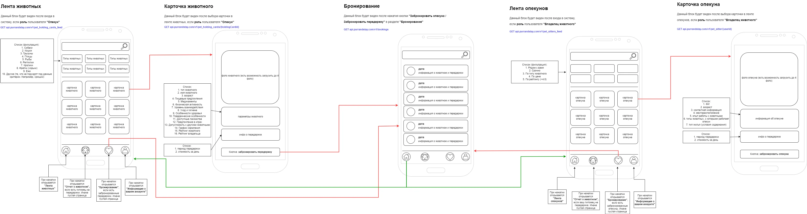

## Объединенные Use Case

В данной диаграмме описан весь функционал, который необходимо сделать для MVP.

## Макеты и роутинг страниц 

Необходимо было подготовить несколько макетов экранов, роутинг между ними и endpoints

